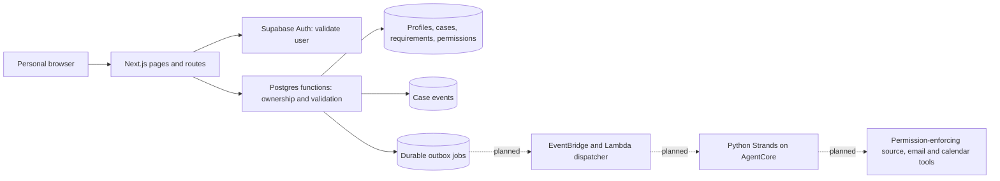

# Verra

Verra is being built to handle the questions and follow-through needed to arrange accessible visits. People describe functional needs, choose what may be shared, and keep each visit's requirements, evidence and next steps together. A statement about an entrance must never become a claim about the whole visit.

## Implementation status

The product foundation and expanded website are implemented and locally verified. An account-free judge workspace now provides a separate interactive simulation of the coordination journey. This is an unfinished product, not a working agent service or a deployed accessibility service.

Working locally:

- Full landing page with interactive visit examples, in-product previews, journey explanation, privacy section, FAQ and direct judge-demo entry.
- Responsive personal workspace with overview, status filters, activity, access needs, settings and a protected personal export. Shared product navigation and remembered light/dark themes use Verra's approved palette.
- Personal Supabase session validation, email-link sign-in routes, callback and sign-out. Actual email delivery and hosted account recovery still require provider verification.
- Saved functional needs, reused privately when creating another visit.
- Visit creation with category, date, timezone, venue/contact, individual hard requirements/preferences and per-need sharing choices.
- Account-isolated records, visit search, requirement states, history and durable database storage.
- Transactional work acceptance, idempotent creation and queue retries, revision checks, pause/resume and cancellation that stops queued work and revokes outreach.
- Unsaved form protection, failed-save preservation and periodic refresh.
- Fixed mobile workspace navigation with a More sheet, sticky form save actions and a visit shortcut that moves focus to the next-step panel without approving anything. The shortcut hides while that panel is in view.
- Device-only Calm mode and independent larger-text, reduced-motion and quiet-layout preferences, available throughout the website and both workspaces. Preferences persist under `verra-reading-preferences` and apply before paint. They never change requirements, evidence, decisions or permissions. System reduced-motion preferences are also respected.

Agent execution, source retrieval, venue correspondence, replies, follow-ups and calendar connections are **not implemented**. Queueing a check persists an outbox job; it does not run an agent. The interface says this explicitly. No real messages are sent by the local preview.

The selected agent model is GPT-5.6 Luna through Amazon Bedrock, with Python Strands on AgentCore. AWS credentials and billing apply to this provider path; a direct OpenAI API key is not required. Actual account access, inference region and tool/API compatibility remain unverified. [Bedrock model documentation](https://docs.aws.amazon.com/bedrock/latest/userguide/model-card-openai-gpt-56-luna.html)

## Explore the judge experience

Open `/demo` directly from the landing page. No account or local account launcher is needed. The judge guide is at `/judges`, and `/privacy` explains the development data boundary.

The judge workspace includes three fictional arrangements with scoped evidence, alternative approval/rejection, explicitly loaded sample replies, sample plans, pause/cancel, reusable sample needs, custom sample creation, search and filters. Demo state is validated before loading and stored only under `verra-judge-demo-v1` in this browser. Reset affects that key's sample state only. It never calls protected account APIs or external providers.

Prepared scenarios can advance from a decision to a sample plan. A custom sample visit has no prepared venue reply and cannot fabricate a plan. Approval requires sharing permission for the needs covered by the sample proposal. Paused/cancelled samples cannot advance replies. These checks exercise demo logic, not live agent tools.

The demo is explicitly a simulation. Its source excerpts, messages and outcomes are fictional. The real product backlog remains required work, and live provider behavior must be verified independently.

## Run locally

Use Node.js 22 or later and npm. Versions are pinned in the lockfile.

```sh
npm ci
npm test
npm run build
npm run preview:local
```

Open http://127.0.0.1:3121 to select a synthetic local account. The actual Next.js app runs at http://127.0.0.1:3120. The test transport at port 3121 emulates only the Auth user endpoint and the listed database functions. It executes the real SQL in PGlite and persists data in ignored `.local-data/preview/`.

This transport uses intentionally non-production test tokens, binds only to loopback and is excluded from Vercel uploads. Do not expose it through a tunnel or use it for real personal information. It does not verify Supabase's hosted Auth, SMTP, PKCE exchange, token refresh, or account recovery.

Run browser checks while the local preview is running:

```sh
npx playwright install chromium
npm run test:browser
npm run typecheck
```

Tests use synthetic people and `example.org`/`example.test` contacts. Database tests create an isolated temporary database and remove it afterward. Browser tests add clearly synthetic records to the local preview accounts. Screenshots stay in ignored `test-results/`.

## Connect the product service

1. Create a dedicated Supabase product project. Apply `supabase/migrations/001_arrangements.sql` once to a fresh database with Supabase Auth enabled.
2. Copy `.env.example` to `.env.local`. Set `SUPABASE_PRODUCT_URL`, the project's **publishable or anon key** in `SUPABASE_PRODUCT_KEY`, and the exact `VERRA_ORIGIN`. Do not use a service-role key for user requests. Session JWTs supply the authenticated user's identity and database role.
3. Configure Supabase's site URL and allow the exact `/auth/callback` redirect URL. Enable email login and configure a verified sender. Email links must use the supported Supabase PKCE flow or a token-hash link to `/auth/callback`; test the actual template before release.
4. Run `npm run dev` or build and run `npm start`. Without settings, sign-in displays a connection-pending state and protected routes reject access.
5. For Vercel, use this directory as the project root and configure the same settings for the deployed HTTPS origin. Never deploy the local test transport or `.local-data/`.
6. Verify signup, email delivery, callback, refresh, expiry, sign-out and isolation using two actual accounts on the deployed domain. A local test result is not production verification.

No repository or deployment is created by these setup scripts. No real credentials belong in source, tests, screenshots or logs.

## Current architecture



Solid connections are the implemented application boundary. Dashed connections remain planned. PGlite supplies the database boundary during local verification, not the hosted services.

Each protected request validates the session with Auth. SQL functions derive ownership from `auth.uid()`; clients cannot choose an owner. RLS permits authenticated users to read only their own rows. Anonymous users cannot read application tables or invoke protected functions. User writes go through explicitly granted functions instead of direct table writes.

Visit creation stores requirements and permissions in one transaction. An `Idempotency-Key` UUID makes retries return the original visit; reuse with changed data is rejected. Start requests persist an outbox job and state revision before returning HTTP 202. Repeating the same work request returns its original job. Pause and cancellation invalidate queued/claimed jobs. Resume does not silently restart work.

The outbox currently stores lease fields but has no dispatcher or worker. Before connecting external effects, implement leases, retry limits/backoff, case revision fencing, permission checks at tool execution, deduplication and reconciliation of uncertain provider results. Cancellation alone cannot undo an external action already accepted by a provider.

## Current routes

| Route | Behavior |
|---|---|
| `POST /auth/signin` | Request a personal email link |
| `GET /auth/callback` | Exchange a login code or verify an email token hash |
| `POST /auth/signout` | Revoke the current Auth session |
| `GET /api/snapshot` | Read the signed-in person's workspace |
| `GET /api/export` | Download an account-isolated personal data export |
| `POST /api/profile` | Save optional name and functional needs |
| `POST /api/cases` | Create a visit with an `Idempotency-Key` header |
| `POST /api/cases/:id/start` | Persist work using `{version, requestKey}` |
| `POST /api/cases/:id/control` | Apply `{version, action}` for pause, resume or cancel |

All writes require the configured same-origin header. Errors do not expose raw database details. Protected responses are not cacheable. Input and response contracts live in `lib/contracts.ts`; authoritative constraints and access rules live in the migration.

## Complete product roadmap

These remain required product work, not optional extras excluded by this first slice.

| Journey | Remaining work |
|---|---|
| Public website | Real-world verified examples, user feedback and complete help |
| Account | Hosted signup verification, recovery, settings, session-expiry UX |
| Access profile | Reusable classifications, revisioned edits and richer consent controls |
| New arrangement | Time/flexible windows, communication preferences and revisioned edits |
| Multiple arrangements | Archive, direct personal-case links, revisioned edits and revisit controls |
| Venue research | Safe public retrieval, evidence attachment and explicit gaps |
| Correspondence | Real send/receive, correlation, delivery status and permitted follow-ups |
| Decisions | Contextual approval, editing, rejection and recorded consequences |
| Evidence | Sources, dates, scope, contradictions and previous versions |
| Alternatives | Supported alternatives that preserve hard requirements |
| Confirmed plan | Verified arrival details, uncertainties and actual calendar connection |
| Changes | Reopen affected checks and dependent actions after edits or new evidence |
| Return visits | Reuse old context while requiring fresh confirmation where needed |
| Companions | Case-scoped invitations, revocation and audit history |
| Notifications | Useful updates, quiet hours and cancellation-aware delivery |
| Data control | Deletion, integration disconnection and published retention; owner-only export is implemented |
| Help and recovery | Failed-job visibility, safe retries and agent handback |

The next implementation packet is revisioned arrangements and durable worker execution, followed by actual Strands tools and verified provider connections. Runtime agent prompts and tools must be included with their implementation when added. Verify access to the selected Luna model and the configured endpoint/region before claiming availability; do not silently substitute another model.

## Verification covered so far

- Real SQL: own-account reads, cross-account denial, anonymous denial, rejected direct writes, atomic validation and scoped permission storage.
- Duplicate creation/work retries, stale revision rejection, database restart persistence, pause/resume and cancellation with outreach revocation.
- Actual production Next.js routes against the loopback test transport: session validation, origin rejection, input validation, private caching and two-account isolation.
- Browser journey: saved profile needs, private defaults, unsaved form protection, create, queue, pause, resume, cancel, reload and sign out.
- Automated WCAG A/AA checks and overflow checks at desktop and mobile widths. Manual assistive-technology, real-device, hosted Auth and all agent/provider verification remain outstanding.


The expanded experience is also checked for demo isolation from protected APIs, requirement-preserving decisions, sharing denial, cancellation, reload persistence, local export, sample creation, filtering, and light/dark accessibility across desktop and mobile. Mobile checks cover bottom-navigation placement, reachable save actions, next-step navigation, More navigation, preference persistence and keyboard focus restoration. Calm-mode automated checks cover 320px, 390px and 1440px widths in both themes. Public pages and demo use authored product views, with no imported reference-product source or private content. Manual assistive-technology and physical-device verification remain outstanding.
