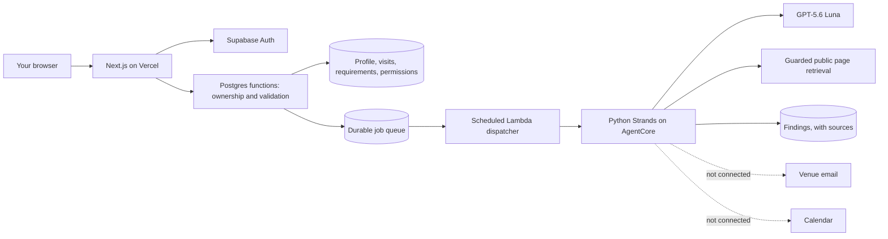

# Verra

**Live app:** https://theverra.vercel.app · **No account needed:** [open the judge demo](https://theverra.vercel.app/demo)

## How Verra started

Verra began with a frustration that bothered us for a long time. We noticed how much effort disabled people must put in just to leave home. Attending a local workshop or simply going for a coffee should not feel like a part-time job. Sadly, for people with disabilities, it often is.

After speaking with friends who use mobility aids, we found out that websites rarely list accessibility details. They have to call venues, wait on hold, and ask repetitive questions about ramps, elevators, or bathroom dimensions. Even after all this, a ramp might exist at the back door but stay locked. Or the building might have an elevator, but the restrooms are too difficult to navigate. This is a very draining burden.

We wanted to build something that takes this headache away. This tedious problem is exactly what AI agents are built to solve. The hackathon gave us the tools and the push to start on it.

## What is Verra?

Verra is a personalized accessibility companion. It works from live sources rather than an outdated crowd-sourced database, and it checks against the needs you actually wrote down instead of a generic accessibility label.

An entrance tells you almost nothing about the rest of a visit. So Verra keeps every requirement separate, records where each answer came from, and refuses to mark a visit settled while something important is still unknown.

Built for the Everyday Agents track.

## Who is it for?

Verra is designed for anyone with a disability or mobility constraint. That includes wheelchair users, people relying on mobility aids, and anyone who needs specific accommodations like zero-step entries or wide doorways.

It is also a tool for caregivers, parents of disabled children, and event coordinators who want their chosen venues to safely accommodate their guests. Verra is for people who refuse to let missing information decide where they can go.

## How does Verra work?

You describe what you need once. You choose a place you want to visit. You decide what may be shared. Verra takes it from there.

**What it does today**

1. Verra reads the venue's public pages, looking for accessibility information.
2. It checks what it finds against your specific requirements, one at a time.
3. It saves each finding with the quote and the source it came from, so you can see exactly where an answer came from.
4. Anything it cannot confirm stays marked unknown. It does not round up to "accessible".
5. Where a question is still open, it drafts the message that would need to go to the venue, and shows it to you for approval.

That last step is where the current build stops. The draft is written and waiting. It is not sent.

**What is built but not connected yet**

6. Sending that message to the venue.
7. Watching for the reply and pulling the answer out of it.
8. Following up when nobody responds.
9. Adding the confirmed visit to your calendar.

We are being deliberate about this. The research, the evidence handling and the drafting are real and running against a live model. Outbound email is not, and we would rather say so than let a demo imply otherwise. Every one of those steps has a designed place in the system, and the queue, permissions and cancellation logic behind them already work.

## Try it without signing up

Open [`/demo`](https://theverra.vercel.app/demo). No account, no email, nothing sent anywhere.

It opens the full workspace with example visits, including the one we kept coming back to: a pottery class where the entrance is step-free but the classroom is upstairs and the lift is out of service. You can approve a question, load an example reply, watch the requirement change state, and pause or cancel the whole thing.

Everything in the demo is fictional and clearly labelled. No venue is ever contacted.

## What is actually working

Honest status, because this is a hackathon build and not a finished service.

**Working and deployed**

- Public site, personal workspace and the account-free demo.
- Accounts, sessions, and records that stay isolated per person.
- A reusable access profile. Write your needs once, reuse them on every visit.
- Visit creation with each requirement marked hard or preferred, and per-requirement sharing permission.
- Revisioned editing. Change a date or a venue and the old details are kept, old jobs stop, and a stale edit cannot overwrite a newer one.
- Pause, resume and cancel, which really do stop queued work.
- The research agent, running on AWS AgentCore against GPT-5.6 Luna, with a scheduled dispatcher claiming work once a minute.
- Bounded page retrieval that refuses private addresses and oversized responses, and validates that a quotation actually appears in the source.
- Accessibility controls: read-aloud, stronger contrast, status shapes that do not rely on colour, larger text, reduced motion, and a Calm mode.

**Not working yet**

- Sending and receiving venue email.
- Reading replies and following up.
- Calendar connection.
- Maps and alternative venue search.
- Notifications.

Sign-in email is rate limited on a shared sender, so the demo is the reliable way in during judging.

## Architecture



Solid lines are deployed and running. Dashed lines are designed and not connected.

The important part is that nothing depends on a process staying alive. A request is written to Postgres inside a transaction along with its job. The dispatcher claims that job with a lease. If the agent dies mid-run, the lease expires and the work is reclaimed, and the old lease token is rejected so a late result cannot overwrite a newer one. Cancelling a visit invalidates queued work rather than hoping nothing has started.

Ownership is decided in SQL from the authenticated user, not passed in by the browser. A client cannot choose whose records it touches.

## Run it locally

Node.js 22 or newer.

```sh
npm ci
npm test
npm run build
npm run preview:local
```

Open http://127.0.0.1:3121 to pick a test account. The app itself runs on port 3120. The test service runs real SQL against a local database, sends no email and runs no agent.

For the Python agent:

```sh
python3.12 -m venv .venv
.venv/bin/python -m pip install -r agent/requirements.lock.txt
.venv/bin/python -m pip install --no-deps -e ./agent
.venv/bin/python -m pytest agent/tests -q
```

Browser checks, with the preview running:

```sh
npx playwright install chromium
npm run test:browser
```

All test data uses invented people and `example.org` addresses.

## Connecting real services

1. Create a Supabase project and apply `supabase/migrations/001_arrangements.sql`, then `002_agent_research.sql`, then `003_arrangement_edits.sql`, once each and in that order.
2. Copy `.env.example` to `.env.local` and set `SUPABASE_PRODUCT_URL`, `SUPABASE_PRODUCT_KEY` (the publishable or anon key, never the service role key) and `VERRA_ORIGIN`.
3. In Supabase, set the site URL and allow `<your-origin>/auth/callback` as a redirect. Enable email login and configure a real SMTP sender.
4. For the agent and the AWS side, see [agent/README.md](agent/README.md) and [infra/README.md](infra/README.md).

`VERRA_ORIGIN` must exactly match the origin people open the app on. If it does not, reads will work and every save will be refused.

## What has been tested

- **Isolation.** Real SQL checks that an account reads only its own rows, that anonymous and cross-account access are refused, and that direct table writes are rejected.
- **Durability.** Duplicate submissions and retries return the original record, stale revisions are rejected, data survives a database restart, and cancelling stops queued work.
- **Routes.** The production build runs against a local transport to check sessions, origin rejection, validation and two-account isolation.
- **Agent.** Python tests cover retrieval limits, grounded quotations, mismatch handling and permission-aware drafting. Database tests cover lease ownership, stale results, replay prevention and retry exhaustion.
- **Browser.** Needs, visits, queue, pause, resume, cancel, edit, reload and sign out, plus a research journey reviewed end to end.
- **Accessibility.** Automated WCAG A/AA and overflow checks at 320px, 390px and 1440px in both themes.

Not yet verified: a full journey on the deployed stack from sign-up to saved report, hosted email delivery, and testing with real assistive technology on physical devices. We have not done user testing with disabled people yet, which is the first thing we want to fix.

## What we are not claiming

Verra does not certify that a place is accessible. It reports what a venue said, where that came from, and when. A confirmed answer can still be that your need cannot be met, and that is a useful answer.

We are not the first people to work on this. AccessNow and Euan's Guide have been doing it longer. What we think is different here is handling one arrangement over time, rather than showing a directory entry.

## Licence

MIT. See [LICENSE](LICENSE).
