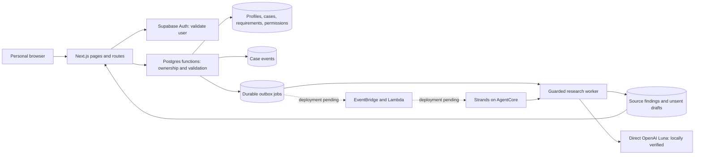

# Verra

Verra is being built to handle the questions and follow-through needed to arrange accessible visits. People describe functional needs, choose what may be shared, and keep each visit's requirements, evidence and next steps together. A statement about an entrance must never become a claim about the whole visit.

## Implementation status

The product foundation and expanded website are implemented and locally verified. An account-free judge workspace now provides a separate interactive simulation of the coordination journey. The research worker now runs locally against the real Luna API. The complete product and hosted service remain unfinished.

Working locally:

- Full landing page with interactive visit examples, in-product previews, journey explanation, privacy section, FAQ and direct judge-demo entry.
- Responsive personal workspace with overview, status filters, activity, access needs, settings and a protected personal export. Shared product navigation and remembered light/dark themes use Verra's approved palette.
- Personal Supabase session validation, email-link sign-in routes, callback and sign-out. Actual email delivery and hosted account recovery still require provider verification.
- Saved functional needs, reused privately when creating another visit.
- Visit creation with category, date, timezone, venue/contact, individual hard requirements/preferences and per-need sharing choices.
- Account-isolated records, visit search, requirement states, history and durable database storage.
- Transactional work acceptance, idempotent creation and queue retries, revision checks, pause/resume and cancellation that stops queued work and revokes outreach.
- Revisioned visit editing for dates, venue/contact, needs and sharing, with previous details kept privately. Changes stop old jobs; stale edits cannot overwrite newer saves. Uncertain saves retry the same request.
- Unsaved form protection, failed-save preservation and periodic refresh.
- Fixed mobile workspace navigation with a More sheet, sticky form save actions and a visit shortcut that moves focus to the next-step panel without approving anything. The shortcut hides while that panel is in view.
- Device-only Calm mode and independent larger-text, reduced-motion and quiet-layout preferences, available throughout the website and both workspaces. Preferences persist under `verra-reading-preferences` and apply before paint. They never change requirements, evidence, decisions or permissions. System reduced-motion preferences are also respected.

The research worker, bounded public-page retrieval, source-quotation validation, durable lease/retry processing, saved findings and an unsent inquiry draft are implemented. Local verification uses real Python/SQL integration with controlled page/model test doubles and explicit synthetic result labels. A configured worker must process queued checks. Direct Luna access and one end-to-end public-page research case passed on September 13, 2026. The actual worker persisted findings through local SQL and displayed them in the app, keeping an unsupported workshop route unknown. AgentCore deployment and hosted recovery are not yet verified. Maps, real venue correspondence, reply processing, follow-ups, alternative search and Calendar remain unimplemented. No real messages are sent by the local preview.

The implemented provider path is direct OpenAI GPT-5.6 Luna through Python Strands, with an AgentCore runtime entry point and scheduled AWS dispatcher. OpenAI model billing requires an OpenAI-issued key, separately from AWS hosting. There is no automatic model fallback. See the [agent setup](agent/README.md) and [AWS deployment instructions](infra/README.md). Live model access is verified locally; cloud hosting remains pending.

## Explore the judge experience

Open `/demo` directly from the landing page. No account or local account launcher is needed. The judge guide is at `/judges`, and `/privacy` explains the development data boundary.

The judge workspace includes three fictional arrangements with scoped evidence, alternative approval/rejection, explicitly loaded sample replies, sample plans, pause/cancel, reusable sample needs, custom sample creation, search and filters. Demo state is validated before loading and stored only under `verra-judge-demo-v1` in this browser. Reset affects that key's sample state only. It never calls protected account APIs or external providers.

Prepared scenarios can advance from a decision to a sample plan. A custom sample visit has no prepared venue reply and cannot fabricate a plan. Approval requires sharing permission for the needs covered by the sample proposal. Paused/cancelled samples cannot advance replies. These checks exercise demo logic, not live agent tools.

The demo is explicitly a simulation. Its source excerpts, messages and outcomes are fictional. The real product backlog remains required work, and live provider behavior must be verified independently.

## Run locally

Use Node.js 22 or later and npm. Versions are pinned in the lockfile.

```sh
npm ci
npm test
npm run build
npm run preview:local
```

Open http://127.0.0.1:3121 to select a synthetic local account. The actual Next.js app runs at http://127.0.0.1:3120. The test transport at port 3121 emulates only the Auth user endpoint and the listed database functions. It executes the real SQL in PGlite and persists data in ignored `.local-data/preview/`.

This transport uses non-production test tokens, binds only to loopback and is excluded from deployment. It does not verify Supabase's hosted Auth, SMTP, PKCE exchange, token refresh or account recovery.

Run browser checks while the local preview is running:

```sh
npx playwright install chromium
npm run test:browser
npm run typecheck
```

Tests use synthetic people and `example.org`/`example.test` contacts. Database tests create an isolated temporary database and remove it afterward. Browser tests add clearly synthetic records to the local preview accounts. Screenshots stay in ignored `test-results/`.

## Connect the product service

1. Create a dedicated Supabase product project with Auth enabled. Apply `001_arrangements.sql`, then `002_agent_research.sql`, then `003_arrangement_edits.sql`, once each and in that order.
2. Copy `.env.example` to `.env.local`. Set `SUPABASE_PRODUCT_URL`, the project's **publishable or anon key** in `SUPABASE_PRODUCT_KEY`, and the exact `VERRA_ORIGIN`. Do not use a service-role key for user requests. Session JWTs supply the authenticated user's identity and database role.
3. Configure Supabase's site URL and allow the exact `/auth/callback` redirect URL. Enable email login and configure a verified sender. Email links must use the supported Supabase PKCE flow or a token-hash link to `/auth/callback`; test the actual template before release.
4. Run `npm run dev` or build and run `npm start`. Without settings, sign-in displays a connection-pending state and protected routes reject access.
5. For Vercel, use this directory as the project root and set the same values for the deployed HTTPS origin.
6. On the deployed domain, check signup, email delivery, callback, refresh, expiry, sign-out and account isolation with two real accounts.


## Current architecture



Solid connections represent implemented code paths. Dashed connections require live configuration and deployment verification. PGlite supplies the database boundary during local verification, not the hosted services.

Each protected request validates the session with Auth. SQL functions derive ownership from `auth.uid()`; clients cannot choose an owner. RLS permits authenticated users to read only their own rows. Anonymous users cannot read application tables or invoke protected functions. User writes go through explicitly granted functions instead of direct table writes.

Visit creation stores requirements and permissions in one transaction. An `Idempotency-Key` UUID makes retries return the original visit; reuse with changed data is rejected. Start requests persist an outbox job and state revision before returning HTTP 202. Repeating the same work request returns its original job. Pause and cancellation invalidate queued/claimed jobs. Resume does not silently restart work.

Migration 002 implements worker leases, bounded retries/backoff, recovery, case revision fencing, owner-only research reports and completion deduplication. The Python worker rechecks active work at tool/model boundaries and before saving. Browser snapshots and direct table permissions exclude lease capabilities. External sending remains disconnected; provider-effect deduplication and uncertain-send reconciliation must be implemented before enabling it. Cancellation cannot undo an external action already accepted by a provider.

Migration 003 adds owner-only revision history and edit receipts, requires fresh sharing review for a changed venue/contact, and captures original requirement wording with every report. Content versions are separate from work-state versions. Edits mark earlier research clearly and remove its draft-copy action; they never silently restart a check. Changed requirements are reopened while unaffected requirement states remain intact. A changed visit context reopens all affected checks.

## Current routes

| Route | Behavior |
|---|---|
| `POST /auth/signin` | Request a personal email link |
| `GET /auth/callback` | Exchange a login code or verify an email token hash |
| `POST /auth/signout` | Revoke the current Auth session |
| `GET /api/snapshot` | Read the signed-in person's workspace |
| `GET /api/export` | Download an account-isolated personal data export |
| `POST /api/profile` | Save optional name and functional needs |
| `POST /api/cases` | Create a visit with an `Idempotency-Key` header |
| `PATCH /api/cases/:id` | Save `{version, visit, recipientReviewed}` with an `Idempotency-Key`; preserve prior details and stop obsolete work |
| `POST /api/cases/:id/start` | Persist work using `{version, requestKey}` |
| `POST /api/cases/:id/control` | Apply `{version, action}` for pause, resume or cancel |

All writes require the configured same-origin header. Errors do not expose raw database details. Protected responses are not cacheable. Input and response contracts live in `lib/contracts.ts`; authoritative constraints and access rules live in the migration.

## Complete product roadmap

These are the journeys Verra is being built to cover. The table shows what is still missing in each one.

| Journey | Remaining work |
|---|---|
| Public website | Real-world verified examples, user feedback and complete help |
| Account | Hosted signup verification, recovery, settings, session-expiry UX |
| Access profile | Reusable classifications, revisioned edits and richer consent controls |
| New arrangement | Time/flexible windows and communication preferences; revisioned date/venue/needs/sharing edits are implemented |
| Multiple arrangements | Archive, direct personal-case links and revisit controls |
| Venue research | Hosted provider verification, broader source coverage and adversarial semantic evaluations; guarded retrieval and saved source quotations are implemented |
| Correspondence | Real send/receive, correlation, delivery status and permitted follow-ups |
| Decisions | Contextual approval, editing, rejection and recorded consequences |
| Evidence | Richer revision/change histories and verified replies; research reports already preserve source dates and quotations |
| Alternatives | Supported alternatives that preserve hard requirements |
| Confirmed plan | Verified arrival details, uncertainties and actual calendar connection |
| Changes | Reopen affected checks and dependent actions after edits or new evidence |
| Return visits | Reuse old context while requiring fresh confirmation where needed |
| Companions | Case-scoped invitations, revocation and audit history |
| Notifications | Useful updates, quiet hours and cancellation-aware delivery |
| Data control | Deletion, integration disconnection and published retention; owner-only export is implemented |
| Help and recovery | Hosted recovery verification and richer user handback; bounded research retry/failure handling is implemented |

Next up are hosted research verification, permitted correspondence and richer evidence decisions. Runtime prompts, tools, migrations, tests and deployment templates are in `agent/` and `infra/`.

## What has been tested

Automated tests cover the database rules, the running Next.js routes, the Python agent and the browser journeys.

- **Data isolation.** Real SQL checks confirm an account reads only its own rows, cross-account and anonymous access are refused, direct table writes are rejected, and permissions are stored scoped to the requirement they belong to.
- **Durability.** Duplicate creation and retried work return the original record, stale revisions are rejected, data survives a database restart, and pause and cancellation stop queued work and revoke pending outreach.
- **Routes.** The production build runs against a loopback test transport to check session validation, origin rejection, input validation, private caching and two-account isolation.
- **Agent.** Python checks cover retrieval restrictions, grounded quotations, mismatch handling, permission-aware drafting and the AgentCore input contract. Database checks cover lease ownership, stale and cancelled results, replay prevention, retry exhaustion and report isolation.
- **Browser journeys.** Saved needs, private defaults, unsaved form protection, create, queue, pause, resume, cancel, edit, reload and sign out. The research journey runs the real worker against synthetic source and model doubles, then reviews the saved report.
- **Accessibility.** Automated WCAG A/AA and overflow checks at 320px, 390px and 1440px in both themes, covering the mobile navigation, reachable save actions, focus restoration and the reading preferences.

Not yet verified: hosted Supabase Auth and email delivery, any deployed AWS component, real correspondence, calendar connections, and testing with assistive technology on physical devices. Local test results do not establish any of these.
