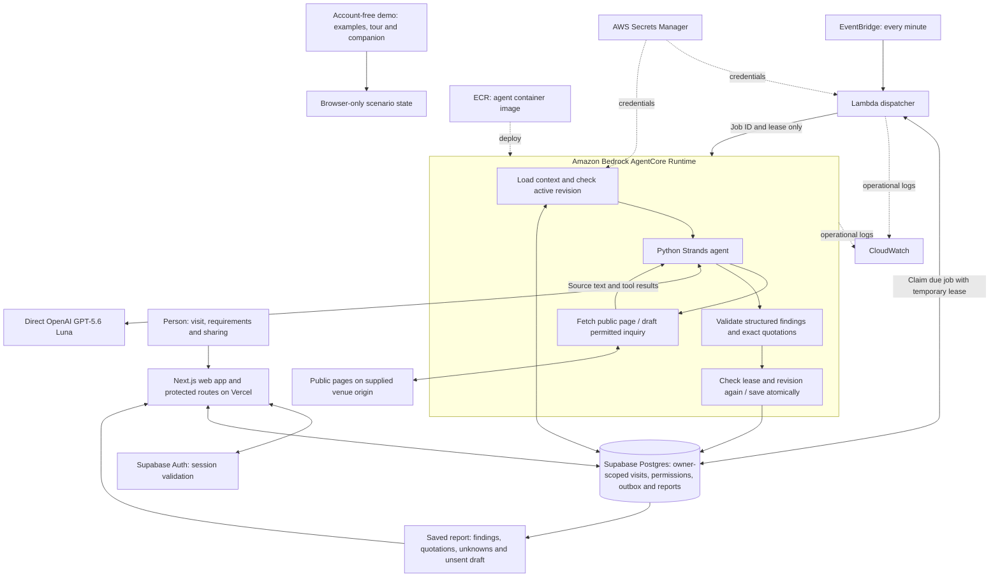

# Verra architecture

The personal research path uses Next.js on Vercel, Supabase Auth/Postgres, a scheduled EventBridge/Lambda dispatcher and Python Strands on Amazon Bedrock AgentCore Runtime. The model provider is direct OpenAI GPT-5.6 Luna. AgentCore hosting does not mean Bedrock model inference.

## What the worker does

The dispatcher claims one due job per scheduled invocation. The runtime receives a job ID and temporary lease, then retrieves its context from Postgres. Strands alternates model calls with available tools, within configured request and token limits. The worker checks cancellation and revisions at model/tool boundaries and before saving. Invalid or stale work cannot replace current findings. Failed attempts use bounded retries, and expired leases can be recovered.

The public-page tool limits origin, redirects, address resolution, bytes and page attempts. Source quotations and requirement coverage are validated before a report is saved. The inquiry draft uses share-approved requirements and requires outreach permission; it is not sent.

## Deployment and verification

The web app and Supabase configuration are deployed. AgentCore reports READY, and EventBridge/Lambda resources exist with recent clean invocations. A real local model research case was previously verified. The complete hosted sign-in-to-report journey remains a separate verification step.

The PNG depicts the deployed research architecture and implemented code paths, not a claim that every path has passed a live user test. Dashed arrows are support or display paths, not a deployment-status legend.

## Separate experiences and future work

The no-account demo is browser-only and uses labelled examples. Its tour and companion do not invoke the model. Real email send/receive, reply processing, follow-ups, map lookup, alternative venue search and Calendar are future integrations and are not drawn as active providers.
